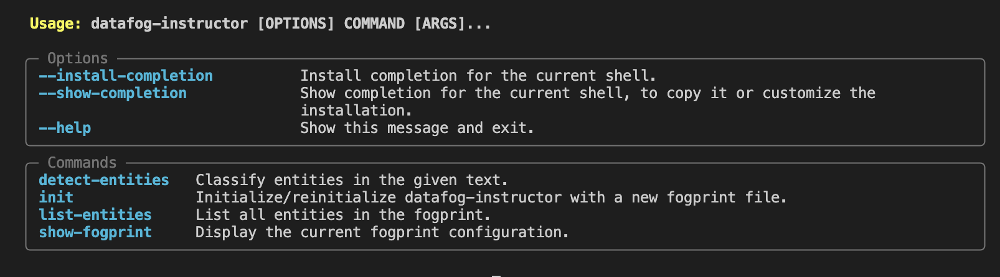

# DataFog Instructor

## Demo

To see DataFog Instructor in action, check out this demo:

<video width="640" height="360" controls>
  <source src="public/common-commands.mov" type="video/quicktime">
  Your browser doesn't support embedded videos.
</video>

This demo showcases the key features and workflow of DataFog Instructor.

datafog-instructor is a tool that allows users to take open-source transformer models and constrain the output to regex-defined expressions. Take a look at our roadmap below if you'd like to see what's coming up!

## Installation

```
pip install --pre datafog-instructor
```

## Quick Start

To see a list of all available options, you can type

```
datafog-instructor --help
```

Which should show you a screen like this:


### Initialize

Type

```
datafog-instructor init
```

into your console, and a default config file containing information about the model, tokenizer, regex_pattern gets loaded into your working directory.

You can see the contents of that by typing:

```
datafog-instructor show-fogprint
```

What is a fogprint? A fogprint is a template that you can re-use, with specific configuration settings for the models, filenames, model_ids, and other important information to instruct an LLM to detect entities. This file is currently saved as fogprint.json.

### Verify the installation:

```

python -m entity_detection list-entities

```

You should see a list of default entity types: PERSON, COMPANY, LOCATION, and ORG.

## Sample Operations

### Detect Entities in Text

```

python -m entity_detection detect-entities --prompt "Apple Inc. was founded by Steve Jobs in Cupertino, California."

```

This will output a table of detected entities, their positions, and types.

### Display Current Configuration

```

python -m entity_detection show-fogprint

```

This command will show you the current configuration stored in `fogprint.json`.

### Reinitialize with Custom Settings

To change the default model or pattern:

1. Edit the `fogprint.json` file directly, or
2. Use the `init` command with the `--force` flag:

```

python -m entity_detection init --force

```

Follow the prompts to update your configuration.

## Advanced Usage

- Adjust the maximum number of tokens generated:

```

python -m entity_detection detect-entities --prompt "Your text here" --max-new-tokens 100

```

- For batch processing or integration into your Python projects, import the `EntityDetector` class from `models.py`.

## Roadmap

Exciting features are coming soon to enhance the SDK's capabilities:

1. **Regex Layer**: We're working on adding a customizable regex layer for even more precise entity detection.
2. **Embeddings Layer**: Future versions will incorporate an embeddings layer to improve entity recognition accuracy.

Stay tuned for updates!

```


## Development and Testing

For development purposes, you can install additional dependencies:

```

pip install requirements-dev.txt

## Documentation

To build the documentation locally:

```

pip install datafog-instructor[docs]
cd docs
sphinx

```

The documentation will be available in the `docs/_build/html` directory.

## Contributing

Contributions to the DataFog Instructor SDK are welcome! Please feel free to submit a Pull Request.

## License

This project is licensed under the MIT License.

## Support

If you encounter any problems or have any questions, please open an issue on the GitHub repository or join our Discord community at https://discord.gg/bzDth394R4.

## Links

- Homepage: https://datafog.ai
- Documentation: https://docs.datafog.ai
- Twitter: https://twitter.com/datafoginc
- GitHub: https://github.com/datafog/datafog-instructor
